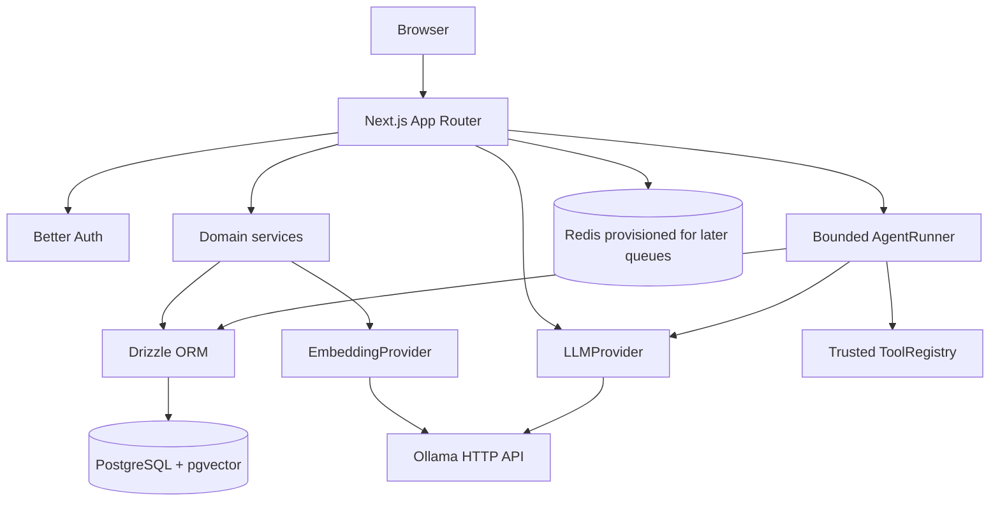

# Architecture

## Milestone 5 boundary

Flowyn is intentionally a modular monolith. Milestones 1 through 4 establish the runtime, authentication, tenant boundary, role-aware membership management, brand foundation, audit trail, provider-agnostic local AI, verified local embeddings, pgvector knowledge, and bounded RAG—not the eventual automation engine.

## Request flow

1. A browser request reaches a Next.js page or route handler.
2. Authentication routes delegate to Better Auth.
3. Protected routes derive the user from the server session.
4. Workspace, membership, and brand services verify the authenticated user's membership and required role before accessing workspace-owned records.
5. Drizzle executes typed PostgreSQL queries.
6. Knowledge operations resolve an authorized brand, chunk manual content, call the configured embedding provider, and store verified vectors with workspace and brand foreign keys.
7. Retrieval embeds the query and applies workspace, brand, and READY filters inside the SQL query before ordering by cosine distance and limiting results.
8. Optional RAG generation combines structured brand data with bounded, explicitly untrusted retrieved knowledge before calling `LLMProvider`.
9. Errors are converted into safe structured responses; connection strings and credentials are never returned.

## Modules

- `lib/auth`: Better Auth configuration and server session helpers.
- `lib/workspaces`: workspace validation, workspace CRUD, membership checks, and workspace audit events.
- `lib/authz`: centralized role and workspace-resource authorization helpers.
- `lib/memberships`: membership validation, listing, invitations, role changes, removal, leaving, and membership audit events.
- `lib/audit`: safe audit event persistence with sensitive metadata filtering.
- `lib/brands`: brand input validation, role-aware CRUD, and brand audit events.
- `lib/database`: PostgreSQL client, typed schema, migration runner, and explicit seed command.
- `lib/health`: dependency probes used by both routes and tests.
- `lib/ai`: provider contract, Ollama HTTP implementation, and generation service.
- `lib/ai/config.ts`: trusted provider/model/timeout/generation configuration.
- `lib/ai/prompt.ts`: reusable system, user, context, brand, and output prompt composition.
- `lib/ai/generation-log.ts`: safe generation metadata persistence without prompt/response storage.
- `lib/embeddings`: verified-dimension embedding contract, typed errors, configuration, and Ollama implementation.
- `lib/knowledge`: sanitized document storage, deterministic chunking, indexing, SQL retrieval, and hybrid BrandContext.
- `lib/agents`: soft-deletable definitions, trusted effective-tool filtering, bounded prompt construction, synchronous runner, safe run history, and brand-scoped internal tools.
- `lib/security`: application error envelope and validation-safe responses.

Business logic belongs in these modules, not in React components.

## Tenant isolation

A workspace is the authorization boundary. Every brand query first resolves the brand’s workspace, then checks membership for the authenticated user. A client-provided resource ID is never sufficient for access. Unauthorized workspace resources return 404 to avoid exposing their existence.

## Data model

Milestone 5 includes Better Auth tables plus:

- `workspaces` and `workspace_members`.
- `brands`, `brand_voice_profiles`, `brand_rules`, and `brand_examples`.
- `audit_logs` for important workspace mutations.
- lookup indexes for workspace, member, brand, and audit-log access paths.
- `generation_logs` for provider, model, status, duration, character counts, and safe error codes.
- `knowledge_documents` for workspace/brand-scoped manual knowledge, content hashes, indexing state, and safe metadata.
- `knowledge_chunks` for deterministic chunks and validated `vector(768)` embeddings from the live `nomic-embed-text` model.
- `agents` for workspace-owned, optionally brand-bound definitions with `allowedTools`, `enabled`, `maxSteps`, and `deletedAt`.
- `agent_runs` and `agent_run_steps` for synchronous terminal status, bounded final responses, and safe step metadata. Run history survives agent soft deletion.

Structured future Brand DNA fields are stored in JSONB where the shape is expected to evolve. Normalized rules and examples remain separate so later ingestion and analysis can attach provenance.

## Runtime services

Compose starts:

- `app`: Next.js development container.
  - `postgres`: pgvector-capable PostgreSQL 16 with a named data volume.
- `redis`: Redis 7 with append-only persistence; no BullMQ worker exists in Milestone 3.
- `ollama`: local inference server with a named model volume.

The host Next.js process can use localhost URLs from `.env.local`; the Compose app uses Docker service names.

## Role policy and workspace API surface

Roles are uppercase and enforced by the database constraint:

- `OWNER`: full workspace, membership, and brand management; can delete the workspace.
- `ADMIN`: can update basic workspace settings, manage brands, and manage ordinary members; cannot change roles, remove owners/admins, or delete the workspace.
- `MEMBER`: read-only workspace and brand access; can leave a workspace.

Protected routes use the Better Auth session:

- `GET/POST /api/workspaces`
- `GET/PATCH/DELETE /api/workspaces/:id`
- `GET/POST /api/workspaces/:id/members`
- `PATCH/DELETE /api/workspaces/:id/members/:userId`
- `POST /api/workspaces/:id/leave`
- `GET/POST /api/brands`, `GET/PATCH/DELETE /api/brands/:id`

Mutation routes record sanitized audit events for workspace, membership, and brand changes. The `workspaceId` on brand creation is checked against the authenticated user's membership; it is never treated as proof of access.

`POST /api/ai/generate` requires the authenticated user to provide a workspace ID. Optional brand context is resolved through the authorized brand service and must belong to that workspace. Complete responses use JSON; `stream: true` returns native provider chunks as Server-Sent Events. Generation logs retain only safe operational metadata.

Knowledge routes are protected by the same session and workspace boundary: `GET/POST /api/knowledge`, `GET/PATCH/DELETE /api/knowledge/:id`, `POST /api/knowledge/:id/reindex`, and `POST /api/knowledge/retrieve`. Client workspace and brand IDs are validated but never trusted without server-side brand ownership and membership checks. Embeddings are never returned to clients.

Agent routes use the same session and workspace boundary: `GET/POST /api/agents`, `GET/PATCH/DELETE /api/agents/:id`, `POST /api/agents/:id/runs`, and `GET /api/agent-runs/:id`. Definitions are soft-deleted with `deletedAt`; disabled definitions remain manageable but reject new runs. The run endpoint is synchronous, accepts only a bounded goal, derives all workspace/user/brand/tool/policy context on the server, and returns a terminal result. History exposes only bounded final output and safe step metadata.

The runner calls `LLMProvider.generateStructured()` with a strict tool-or-final decision schema. Its effective tools are configured names intersected with registered tools and tools valid for the trusted runtime brand context. Model observations are bounded and inserted only into delimited untrusted prompt sections; persisted steps store decision types, tool names, counts, durations, and safe error codes, never raw observations or hidden reasoning. Request aborts propagate through `AbortSignal`; durable cross-request cancellation is deferred.

## Extension points

- Add a new AI provider by implementing `LLMProvider` in `lib/ai` and selecting it through trusted server configuration in `getAIProvider`.
- Add a new health probe by implementing a safe probe in `lib/health` and a route under `app/api/health`.
- Add a new workspace-owned module by requiring membership before the first read/write and adding its workspace foreign key to the schema.
- Add a new embedding provider by implementing `EmbeddingProvider` and preserving explicit dimension validation.
- Later milestones can add queue and workflow services without moving domain logic into the UI.
