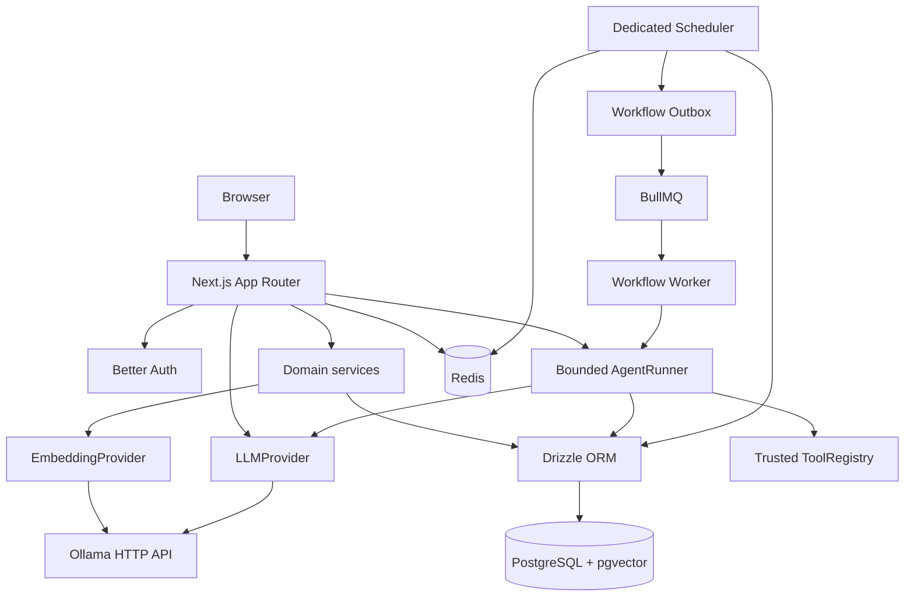

# Architecture

## Milestone 10 boundary

Flowyn is intentionally a modular monolith. Milestones 1 through 4 establish the runtime, authentication, tenant boundary, role-aware membership management, brand foundation, audit trail, provider-agnostic local AI, verified local embeddings, pgvector knowledge, and bounded RAG—not the eventual automation engine.

## Request flow

1. A browser request reaches a Next.js page or route handler.
2. Authentication routes delegate to Better Auth.
3. Protected routes derive the user from the server session.
4. Workspace, membership, and brand services verify the authenticated user's membership and required role before accessing workspace-owned records.
5. Drizzle executes typed PostgreSQL queries.
6. Knowledge operations resolve an authorized brand, chunk manual content, call the configured embedding provider, and store verified vectors with workspace and brand foreign keys.
7. Retrieval embeds the query and applies workspace, brand, and READY filters inside the SQL query before ordering by cosine distance and limiting results.
8. Optional RAG generation combines structured brand data with bounded, explicitly untrusted retrieved knowledge before calling `LLMProvider`.
9. Errors are converted into safe structured responses; connection strings and credentials are never returned.

## Modules

- `lib/auth`: Better Auth configuration and server session helpers.
- `lib/workspaces`: workspace validation, workspace CRUD, membership checks, and workspace audit events.
- `lib/authz`: centralized role and workspace-resource authorization helpers.
- `lib/memberships`: membership validation, listing, invitations, role changes, removal, leaving, and membership audit events.
- `lib/audit`: safe audit event persistence with sensitive metadata filtering.
- `lib/brands`: brand input validation, role-aware CRUD, and brand audit events.
- `lib/database`: PostgreSQL client, typed schema, migration runner, and explicit seed command.
- `lib/health`: dependency probes used by both routes and tests.
- `lib/ai`: provider contract, Ollama HTTP implementation, and generation service.
- `lib/ai/config.ts`: trusted provider/model/timeout/generation configuration.
- `lib/ai/prompt.ts`: reusable system, user, context, brand, and output prompt composition.
- `lib/ai/generation-log.ts`: safe generation metadata persistence without prompt/response storage.
- `lib/embeddings`: verified-dimension embedding contract, typed errors, configuration, and Ollama implementation.
- `lib/knowledge`: sanitized document storage, deterministic chunking, indexing, SQL retrieval, and hybrid BrandContext.
- `lib/agents`: soft-deletable definitions, trusted effective-tool filtering, bounded prompt construction, synchronous runner, safe run history, and brand-scoped internal tools.
- `lib/schedules`: schedule validation, timezone-aware calculation, bounded misfire policy, atomic occurrence processing, scheduler runtime, and heartbeat health.
- `lib/webhooks`: HMAC protocol, versioned encrypted secrets, bounded ingress, Redis admission limits, PostgreSQL delivery deduplication, management services, and safe delivery projections.
- `lib/security`: application error envelope and validation-safe responses.

Business logic belongs in these modules, not in React components.

## Durable workflow execution

Workflow definitions are bounded JSON graphs with one entry step, reachable nodes, forward references only, and no cycles. Supported steps are SET_VALUE, TRANSFORM, CONDITION, AI_GENERATE, AGENT, and APPROVAL. The executor registry is static and does not load code or tools from workflow JSON.

Workflow edits validate the complete candidate definition, append an immutable workflow_versions row, and update the workflow current-version fields in one transaction. Every queued run copies the selected version into definitionSnapshot, so later edits cannot change a queued run.

Run creation inserts workflow_runs and workflow_run_dispatches in one PostgreSQL transaction. The reusable outbox dispatcher claims pending, failed, or stale claimed rows with a lease, then enqueues a deterministic job. BullMQ 6 rejects colons in custom IDs, so the logical identity workflow-run:<runId> maps to the deterministic BullMQ-safe ID workflow-run-<runId>; the job payload contains only runId.

The worker claims queued or stale running runs with a random execution token and lease. Heartbeats renew the lease. Every step attempt and run transition requires the current token and an unexpired lease; stale recovery interrupts old attempts and creates a new attempt. This is at-least-once execution and does not claim exactly-once side effects.

Durable outputs are bounded JSON values stored separately from safe metadata. Metadata contains only operational facts such as operation, counts, model name, duration, and error code. Hidden reasoning, raw observations, credentials, unrestricted tool output, dynamic code, shell, arbitrary SQL, filesystem, HTTP, and browser execution are out of scope.

## Durable workflow scheduling

workflow_schedules is the authoritative schedule state. workflow_schedule_occurrences records each logical scheduled instant with a unique (schedule_id, scheduled_for) constraint. PostgreSQL claims due schedules with short FOR UPDATE SKIP LOCKED transactions. A transaction records the occurrence, reuses workflow snapshot/run/outbox creation, advances the schedule, and commits without executing a step or calling Ollama.

The dedicated scheduler process polls PostgreSQL and uses Redis only for its liveness heartbeat. The existing outbox dispatcher publishes the created run to BullMQ, and the existing worker executes it. Duplicate scheduler processes are safe because occurrence uniqueness and workflow idempotency use a deterministic schedule/instant key.

CRON accepts five fields and stores UTC instants with an IANA timezone. INTERVAL uses bounded seconds, and ONE_TIME consumes itself after a triggered or skipped occurrence. SKIP and FIRE_ONCE never backfill an unbounded history. Observed cron-parser DST behavior is contractual through tests.

Scheduled AI and Agent steps reuse LLMProvider, BrandContext/RAG, and the controlled AgentRunner through a workspace automation principal. No user record is fabricated and workflow_runs.started_by remains NULL. The schedule and occurrence provide the verified workspace/schedule scope to the executor.

## Secure inbound workflow webhooks

`workflow_webhook_triggers` stores workspace/workflow ownership, a random public identifier, enabled state, and an encrypted versioned secret. `workflow_webhook_events` stores bounded delivery metadata and a unique `(trigger_id, dedupe_key)` barrier; it never stores raw request bodies, headers, signatures, or plaintext secrets. Event metadata expires through a bounded scheduler maintenance pass.

`POST /api/hooks/:publicId` applies Redis global/per-trigger admission limits, bounds the raw body, verifies the timestamp and HMAC over the exact bytes, validates the existing workflow input contract, and performs one PostgreSQL transaction. That transaction inserts or deduplicates the event, handles disabled/deleted workflows as safe `SKIPPED` history, or creates the existing workflow run and outbox record. The route returns `202` only after commit. Redis is not correctness state and public ingress fails closed when Redis is unavailable.

The public request cannot supply or override workspace, user, workflow, role, principal, tool, model, endpoint, or execution configuration. Accepted webhook runs use `started_by = NULL` and the existing workspace automation principal with a webhook trigger/event origin. The worker still resolves the workflow snapshot and uses only the static workflow registry, LLMProvider, workspace/brand-filtered RAG, and controlled AgentRunner. There is no outbound HTTP, OAuth, arbitrary network, shell, SQL, filesystem, code, or browser capability.

## Tenant isolation

A workspace is the authorization boundary. Every brand query first resolves the brand’s workspace, then checks membership for the authenticated user. A client-provided resource ID is never sufficient for access. Unauthorized workspace resources return 404 to avoid exposing their existence.

## Data model

Milestones 6 and 7 include Better Auth tables plus:

- `workspaces` and `workspace_members`.
- `brands`, `brand_voice_profiles`, `brand_rules`, and `brand_examples`.
- `audit_logs` for important workspace mutations.
- lookup indexes for workspace, member, brand, and audit-log access paths.
- `generation_logs` for provider, model, status, duration, character counts, and safe error codes.
- `knowledge_documents` for workspace/brand-scoped manual knowledge, content hashes, indexing state, and safe metadata.
- `knowledge_chunks` for deterministic chunks and validated `vector(768)` embeddings from the live `nomic-embed-text` model.
- `agents` for workspace-owned, optionally brand-bound definitions with `allowedTools`, `enabled`, `maxSteps`, and `deletedAt`.
- `agent_runs` and `agent_run_steps` for synchronous terminal status, bounded final responses, and safe step metadata. Run history survives agent soft deletion.
- `workflow_editor_layouts` for one workspace-scoped, version-associated current canvas layout per workflow. It stores only bounded coordinates and viewport metadata.

Structured future Brand DNA fields are stored in JSONB where the shape is expected to evolve. Normalized rules and examples remain separate so later ingestion and analysis can attach provenance.

The schedule tables are workflow_schedules and workflow_schedule_occurrences. The latter stores bounded trigger outcomes and links to workflow runs; its unique schedule/instant key is the duplicate barrier.
Webhook tables are workflow_webhook_triggers and workflow_webhook_events. The latter stores payload hashes/sizes, bounded dedupe state, safe status/reason metadata, expiry, and an optional workflow-run link. Secret ciphertext is never returned by safe projections.

## Runtime services

Compose starts:

- `app`: Next.js development container.
  - `postgres`: pgvector-capable PostgreSQL 16 with a named data volume.
- `redis`: Redis 7 with append-only persistence; no BullMQ worker exists in Milestone 3.
- `ollama`: local inference server with a named model volume.
- `scheduler`: dedicated database-backed schedule poller with a Redis heartbeat; it shares the app image and does not add a queue, database, Ollama instance, or volume.

The host Next.js process can use localhost URLs from `.env.local`; the Compose app uses Docker service names.

## Role policy and workspace API surface

Roles are uppercase and enforced by the database constraint:

- `OWNER`: full workspace, membership, and brand management; can delete the workspace.
- `ADMIN`: can update basic workspace settings, manage brands, and manage ordinary members; cannot change roles, remove owners/admins, or delete the workspace.
- `MEMBER`: read-only workspace and brand access; can leave a workspace.

Protected routes use the Better Auth session:

- `GET/POST /api/workspaces`
- `GET/PATCH/DELETE /api/workspaces/:id`
- `GET/POST /api/workspaces/:id/members`
- `PATCH/DELETE /api/workspaces/:id/members/:userId`
- `POST /api/workspaces/:id/leave`
- `GET/POST /api/brands`, `GET/PATCH/DELETE /api/brands/:id`

Mutation routes record sanitized audit events for workspace, membership, and brand changes. The `workspaceId` on brand creation is checked against the authenticated user's membership; it is never treated as proof of access.

`POST /api/ai/generate` requires the authenticated user to provide a workspace ID. Optional brand context is resolved through the authorized brand service and must belong to that workspace. Complete responses use JSON; `stream: true` returns native provider chunks as Server-Sent Events. Generation logs retain only safe operational metadata.

Schedule routes are GET/POST /api/workflow-schedules, GET/PATCH/DELETE /api/workflow-schedules/:id, POST /api/workflow-schedules/:id/enable, POST /api/workflow-schedules/:id/disable, and GET /api/workflow-schedules/:id/occurrences. Members can read schedules and history; admins and owners can mutate schedules. Every schedule, workflow, occurrence, and run lookup is checked against the authenticated workspace.

Webhook routes are GET/POST /api/workflow-webhooks, GET/PATCH/DELETE /api/workflow-webhooks/:id, POST /api/workflow-webhooks/:id/enable, POST /api/workflow-webhooks/:id/disable, POST /api/workflow-webhooks/:id/rotate-secret, and GET /api/workflow-webhooks/:id/events. Members can read safe trigger/history projections; admins and owners can mutate. Public POST /api/hooks/:publicId is authenticated by the trigger secret and is restricted to the trigger's configured workflow.

Workflow routes include GET/POST `/api/workflows`, GET/PATCH/DELETE `/api/workflows/:id`, and POST `/api/workflows/:id/runs`. The resource GET is the authorized editor projection; the resource PATCH is the authoritative save path. Members with the existing `workflow.write` action can edit, while server validation remains authoritative for executable definitions and referenced resources.

Knowledge routes are protected by the same session and workspace boundary: `GET/POST /api/knowledge`, `GET/PATCH/DELETE /api/knowledge/:id`, `POST /api/knowledge/:id/reindex`, and `POST /api/knowledge/retrieve`. Client workspace and brand IDs are validated but never trusted without server-side brand ownership and membership checks. Embeddings are never returned to clients.

Agent routes use the same session and workspace boundary: `GET/POST /api/agents`, `GET/PATCH/DELETE /api/agents/:id`, `POST /api/agents/:id/runs`, and `GET /api/agent-runs/:id`. Definitions are soft-deleted with `deletedAt`; disabled definitions remain manageable but reject new runs. The run endpoint is synchronous, accepts only a bounded goal, derives all workspace/user/brand/tool/policy context on the server, and returns a terminal result. History exposes only bounded final output and safe step metadata.

The runner calls `LLMProvider.generateStructured()` with a strict tool-or-final decision schema. Its effective tools are configured names intersected with registered tools and tools valid for the trusted runtime brand context. Model observations are bounded and inserted only into delimited untrusted prompt sections; persisted steps store decision types, tool names, counts, durations, and safe error codes, never raw observations or hidden reasoning. Request aborts propagate through `AbortSignal`; durable cross-request cancellation is deferred.

## Durable human approval gates

Milestone 9 adds a static `APPROVAL` step to the existing workflow registry. Its policy is part of the immutable workflow definition snapshot: `requiredRole` is `OWNER` or `ADMIN`, and `expiresAfterSeconds` is optional with bounds of 60 through 31,536,000 seconds. The executor emits a control result; it never decides and never calls an external system.

When the worker reaches the step, PostgreSQL atomically creates one workspace-scoped `workflow_approval_requests` row, marks the step and run `WAITING_APPROVAL`, and clears the execution lease. No BullMQ worker is held. Approval, rejection, expiration, and waiting cancellation lock the approval/run state and update the request, step, run, audit event, and—on approval—the existing outbox continuation in one transaction.

Approval context is a bounded projection of historical names, run/version identifiers, origin kind, required role, timestamps, and operational counts. It excludes raw workflow input, webhook bodies, prompts, hidden reasoning, unrestricted tool output, credentials, and secrets. Workflow names and step names are copied into the request so historical inbox entries remain readable after soft deletion.

The existing outbox row remains one row per run. Initial dispatch uses generation 0; approval increments the durable integer generation, resets the row to `PENDING`, and uses a BullMQ job identity containing run ID and generation. The job payload remains only the run ID. PostgreSQL claim/state transitions remain authoritative against duplicate delivery and crash recovery.

Approval APIs use Better Auth, centralized workspace actions, and current membership roles. Members can read safe projections. Only an authenticated current ADMIN or OWNER satisfying the stored policy can decide; self-approval is allowed. Automation principals can reach the step but have no decision route or decision authority. The scheduler performs bounded expiration maintenance and lazy decision paths provide correctness when the scheduler is delayed.

Milestone 9 introduces no outbound HTTP, OAuth, third-party credentials, public approval links, browser automation, file uploads, arbitrary execution, or new queue/service boundary.

## Server-validated visual workflow editor

Milestone 10 adds an authoring projection over the existing workflow engine. `WorkflowDefinition` remains the only executable representation; the existing static registry, Zod schema, graph validator, resource checks, immutable versions, outbox, scheduler, webhook, approval, and worker paths remain authoritative.

The existing workflow GET returns metadata, the current definition, `currentVersionId`, the version number, and a compatible layout. Definition or layout PATCHes include `expectedVersionId`; the service locks the workflow row in PostgreSQL and returns `WORKFLOW_VERSION_CONFLICT` with HTTP 409 when another writer has advanced the token. Metadata-only updates remain compatible without a version token.

The browser uses `@xyflow/react` only as a presentation/editor surface. It supports the six registered step types, drag positions, viewport state, configuration editing, and an Advanced JSON view. Canvas and raw JSON both serialize to the same `WorkflowDefinition` and pass the same server-side validation. No client-supplied node type, edge, agent, brand, workspace, role, or executable capability is trusted.

`workflow_editor_layouts` stores only bounded node coordinates and viewport metadata, scoped to a workflow and the version it was viewed with. Layout never contributes to definition hashes, immutable version JSON, workflow snapshots, scheduling, webhook delivery, approval state, or execution. Missing, malformed, mismatched, or incomplete layouts fall back to a deterministic default.

Milestone 10 introduces no outbound HTTP, OAuth, credentials, file uploads, browser automation, dynamic modules, arbitrary expressions, second queue, or second runtime. Milestone 11 has not started.

## Extension points

- Add a new AI provider by implementing `LLMProvider` in `lib/ai` and selecting it through trusted server configuration in `getAIProvider`.
- Add a new health probe by implementing a safe probe in `lib/health` and a route under `app/api/health`.
- Add a new workspace-owned module by requiring membership before the first read/write and adding its workspace foreign key to the schema.
- Add a new embedding provider by implementing `EmbeddingProvider` and preserving explicit dimension validation.
- Later milestones can add queue and workflow services without moving domain logic into the UI.
