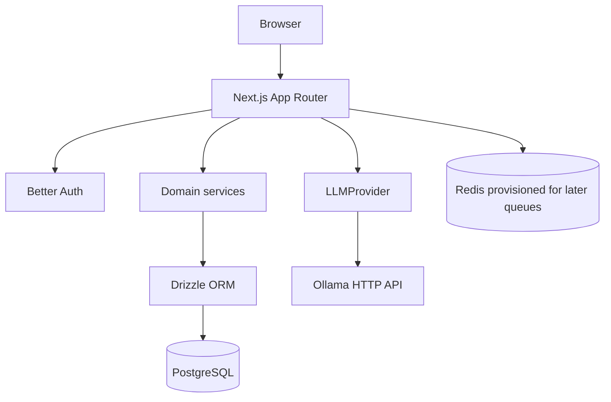

# Architecture

## Milestone 1 boundary

Flowyn is intentionally a modular monolith. Milestone 1 establishes the runtime and tenant-aware foundation, not the eventual automation engine.

## Request flow

1. A browser request reaches a Next.js page or route handler.
2. Authentication routes delegate to Better Auth.
3. Protected routes derive the user from the server session.
4. Workspace and brand services verify membership before accessing workspace-owned records.
5. Drizzle executes typed PostgreSQL queries.
6. AI generation calls the `LLMProvider` interface, whose Milestone 1 implementation is `OllamaProvider`.
7. Errors are converted into safe structured responses; connection strings and credentials are never returned.

## Modules

- `lib/auth`: Better Auth configuration and server session helpers.
- `lib/workspaces`: workspace input validation, membership checks, creation, listing, and audit creation.
- `lib/brands`: brand input validation and CRUD service operations.
- `lib/database`: PostgreSQL client, typed schema, migration runner, and explicit seed command.
- `lib/health`: dependency probes used by both routes and tests.
- `lib/ai`: provider contract, Ollama HTTP implementation, and generation service.
- `lib/security`: application error envelope and validation-safe responses.

Business logic belongs in these modules, not in React components.

## Tenant isolation

A workspace is the authorization boundary. Every brand query first resolves the brand’s workspace, then checks membership for the authenticated user. A client-provided resource ID is never sufficient for access. Unauthorized workspace resources return 404 to avoid exposing their existence.

## Data model

Milestone 1 includes Better Auth tables plus:

- `workspaces` and `workspace_members`.
- `brands`, `brand_voice_profiles`, `brand_rules`, and `brand_examples`.
- `audit_logs` for important workspace mutations.

Structured future Brand DNA fields are stored in JSONB where the shape is expected to evolve. Normalized rules and examples remain separate so later ingestion and analysis can attach provenance.

## Runtime services

Compose starts:

- `app`: Next.js development container.
- `postgres`: PostgreSQL 16 with a named data volume.
- `redis`: Redis 7 with append-only persistence; no BullMQ worker exists in Milestone 1.
- `ollama`: local inference server with a named model volume.

The host Next.js process can use localhost URLs from `.env.local`; the Compose app uses Docker service names.

## Extension points

- Add a new AI provider by implementing `LLMProvider` in `lib/ai` and selecting it in `getLLMProvider`.
- Add a new health probe by implementing a safe probe in `lib/health` and a route under `app/api/health`.
- Add a new workspace-owned module by requiring membership before the first read/write and adding its workspace foreign key to the schema.
- Later milestones can add queue and workflow services without moving domain logic into the UI.