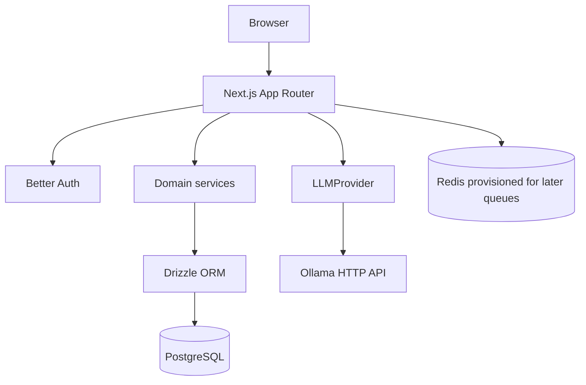

# Architecture

## Milestone 3 boundary

Flowyn is intentionally a modular monolith. Milestones 1 through 3 establish the runtime, authentication, tenant boundary, role-aware membership management, brand foundation, audit trail, and provider-agnostic local AI engine—not the eventual automation engine.

## Request flow

1. A browser request reaches a Next.js page or route handler.
2. Authentication routes delegate to Better Auth.
3. Protected routes derive the user from the server session.
4. Workspace, membership, and brand services verify the authenticated user's membership and required role before accessing workspace-owned records.
5. Drizzle executes typed PostgreSQL queries.
6. AI generation verifies workspace access, builds an optional brand-aware prompt, and calls the `LLMProvider` interface through the configured Ollama implementation.
7. Errors are converted into safe structured responses; connection strings and credentials are never returned.

## Modules

- `lib/auth`: Better Auth configuration and server session helpers.
- `lib/workspaces`: workspace validation, workspace CRUD, membership checks, and workspace audit events.
- `lib/authz`: centralized role and workspace-resource authorization helpers.
- `lib/memberships`: membership validation, listing, invitations, role changes, removal, leaving, and membership audit events.
- `lib/audit`: safe audit event persistence with sensitive metadata filtering.
- `lib/brands`: brand input validation, role-aware CRUD, and brand audit events.
- `lib/database`: PostgreSQL client, typed schema, migration runner, and explicit seed command.
- `lib/health`: dependency probes used by both routes and tests.
- `lib/ai`: provider contract, Ollama HTTP implementation, and generation service.
- `lib/ai/config.ts`: trusted provider/model/timeout/generation configuration.
- `lib/ai/prompt.ts`: reusable system, user, context, brand, and output prompt composition.
- `lib/ai/generation-log.ts`: safe generation metadata persistence without prompt/response storage.
- `lib/security`: application error envelope and validation-safe responses.

Business logic belongs in these modules, not in React components.

## Tenant isolation

A workspace is the authorization boundary. Every brand query first resolves the brand’s workspace, then checks membership for the authenticated user. A client-provided resource ID is never sufficient for access. Unauthorized workspace resources return 404 to avoid exposing their existence.

## Data model

Milestone 3 includes Better Auth tables plus:

- `workspaces` and `workspace_members`.
- `brands`, `brand_voice_profiles`, `brand_rules`, and `brand_examples`.
- `audit_logs` for important workspace mutations.
- lookup indexes for workspace, member, brand, and audit-log access paths.
- `generation_logs` for provider, model, status, duration, character counts, and safe error codes.

Structured future Brand DNA fields are stored in JSONB where the shape is expected to evolve. Normalized rules and examples remain separate so later ingestion and analysis can attach provenance.

## Runtime services

Compose starts:

- `app`: Next.js development container.
- `postgres`: PostgreSQL 16 with a named data volume.
- `redis`: Redis 7 with append-only persistence; no BullMQ worker exists in Milestone 3.
- `ollama`: local inference server with a named model volume.

The host Next.js process can use localhost URLs from `.env.local`; the Compose app uses Docker service names.

## Role policy and workspace API surface

Roles are uppercase and enforced by the database constraint:

- `OWNER`: full workspace, membership, and brand management; can delete the workspace.
- `ADMIN`: can update basic workspace settings, manage brands, and manage ordinary members; cannot change roles, remove owners/admins, or delete the workspace.
- `MEMBER`: read-only workspace and brand access; can leave a workspace.

Protected routes use the Better Auth session:

- `GET/POST /api/workspaces`
- `GET/PATCH/DELETE /api/workspaces/:id`
- `GET/POST /api/workspaces/:id/members`
- `PATCH/DELETE /api/workspaces/:id/members/:userId`
- `POST /api/workspaces/:id/leave`
- `GET/POST /api/brands`, `GET/PATCH/DELETE /api/brands/:id`

Mutation routes record sanitized audit events for workspace, membership, and brand changes. The `workspaceId` on brand creation is checked against the authenticated user's membership; it is never treated as proof of access.

`POST /api/ai/generate` requires the authenticated user to provide a workspace ID. Optional brand context is resolved through the authorized brand service and must belong to that workspace. Complete responses use JSON; `stream: true` returns native provider chunks as Server-Sent Events. Generation logs retain only safe operational metadata.

## Extension points

- Add a new AI provider by implementing `LLMProvider` in `lib/ai` and selecting it through trusted server configuration in `getAIProvider`.
- Add a new health probe by implementing a safe probe in `lib/health` and a route under `app/api/health`.
- Add a new workspace-owned module by requiring membership before the first read/write and adding its workspace foreign key to the schema.
- Later milestones can add queue and workflow services without moving domain logic into the UI.
